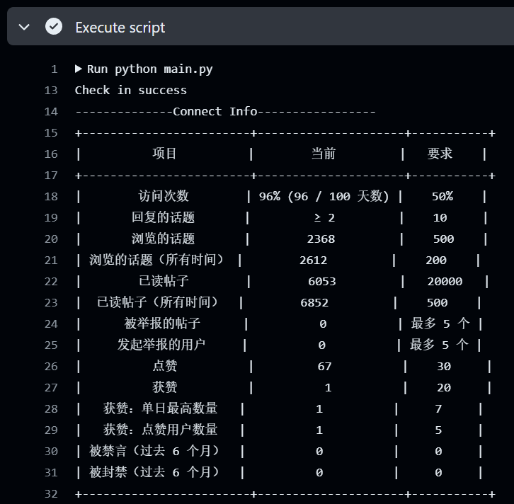

# LinuxDo 每日签到

## 一、项目描述

这个项目用于自动登录 [LinuxDo](https://linux.do/) 网站并浏览帖子，以达到自动签到的功能。

使用 Python + DrissionPage 自动化库模拟真实浏览器操作，支持 GitHub Actions 和青龙面板自动运行。

## 二、功能特性

- ✅ 自动登录 LinuxDo
- ✅ 自动浏览最新帖子（按顺序浏览前 10 个）
- ✅ 随机点赞（30% 概率）
- ✅ 统计阅读评论数
- ✅ 获取用户等级和升级进度
- ✅ Cloudflare 5秒盾自动检测和等待
- ✅ 支持多种通知渠道（Telegram、Gotify、Server酱³、wxpush）
- ✅ 支持 GitHub Actions 自动运行
- ✅ 支持青龙面板自动运行

## 三、环境变量配置

### 必填变量

| 环境变量名称 | 描述 | 示例值 |
|-------------|------|--------|
| `LINUXDO_USERNAME` | 你的 LinuxDo 用户名或邮箱 | `your_username` 或 `your@email.com` |
| `LINUXDO_PASSWORD` | 你的 LinuxDo 密码 | `your_password` |

> 注：`USERNAME` 和 `PASSWORD` 环境变量仍然可用，但建议使用新的环境变量名称。

### 可选变量

| 环境变量名称 | 描述 | 示例值 |
|-------------|------|--------|
| `BROWSE_ENABLED` | 是否启用浏览帖子功能 | `true` 或 `false`，默认为 `true` |
| `TELEGRAM_TOKEN` | Telegram Bot Token | `123456789:ABCdefghijklmnopqrstuvwxyz` |
| `TELEGRAM_USERID` | Telegram 用户 ID | `123456789` |
| `GOTIFY_URL` | Gotify 服务器地址 | `https://your.gotify.server:8080` |
| `GOTIFY_TOKEN` | Gotify 应用的 API Token | `your_application_token` |
| `SC3_PUSH_KEY` | Server酱³ SendKey | `sctpxxxxt` |
| `WXPUSH_URL` | wxpush 服务器地址 | `https://your.wxpush.server` |
| `WXPUSH_TOKEN` | wxpush 的 token | `your_wxpush_token` |

## 四、GitHub Actions 使用

### 4.1 Fork 仓库

点击本仓库右上角的 `Fork` 按钮，将仓库 Fork 到你的账号下。

### 4.2 配置 Secrets（重要）

> ⚠️ **注意**：环境变量必须添加到 **"秘密"（Secrets）** 中，而不是 "变量"（Variables）！
>
> GitHub 设置页面有两个选项卡：**"秘密"** 和 **"变量"**。请确保选择 **"秘密"** 选项卡！

**详细步骤：**

1. 进入你 Fork 的仓库页面
2. 点击顶部的 **`Settings`**（设置）
3. 在左侧菜单找到 **`Secrets and variables`**（秘密与变量）
4. 点击展开后选择 **`Actions`**
5. 你会看到页面上有两个选项卡：**"秘密【Secrets
】"** 和 **"变量【Variables】"**
6. **确保选择 "秘密【Secrets】" 选项卡**（默认应该就是）
7. 在 **"存储库密钥"** 区域，点击右侧的 **`新存储库密钥【new repository secret】`** 按钮
8. 填写 **Name**（名称）和 **Secret**（值），然后点击 **`Add secret`**

**需要添加的 Secrets：**

| Name（名称） | Secret（值） | 必填 |
|-------------|-------------|------|
| `LINUXDO_USERNAME` | 你的 LinuxDo 用户名或邮箱 | ✅ 必填 |
| `LINUXDO_PASSWORD` | 你的 LinuxDo 密码 | ✅ 必填 |
| `TELEGRAM_TOKEN` | Telegram Bot Token | 可选 |
| `TELEGRAM_USERID` | Telegram 用户 ID | 可选 |
| `GOTIFY_URL` | Gotify 服务器地址 | 可选 |
| `GOTIFY_TOKEN` | Gotify 应用 Token | 可选 |
| `SC3_PUSH_KEY` | Server酱³ SendKey | 可选 |
| `WXPUSH_URL` | wxpush 服务器地址 | 可选 |
| `WXPUSH_TOKEN` | wxpush Token | 可选 |
| `BROWSE_ENABLED` | 是否启用浏览帖子（默认 true） | 可选 |

**添加完成后的效果：**

在 "存储库密钥" 列表中应该能看到你添加的所有密钥，例如：
```
LINUXDO_PASSWORD    刚刚
LINUXDO_USERNAME    刚刚
TELEGRAM_TOKEN      刚刚
TELEGRAM_USERID     刚刚
```

### 4.3 启用 Actions

1. 进入仓库的 **`Actions`** 选项卡
2. 如果看到提示，点击 **`I understand my workflows, go ahead and enable them`**
3. 工作流会自动每 12 小时运行一次

### 4.4 手动触发

1. 进入 **`Actions`** 选项卡
2. 在左侧选择 **`Daily Check-in`** 工作流
3. 点击右侧的 **`Run workflow`** 按钮
4. 选择分支（默认 main），点击绿色的 **`Run workflow`** 按钮启动

### 4.5 查看运行结果

1. 进入 **`Actions`** 选项卡
2. 点击最新的 **`Daily Check-in`** 运行记录
3. 点击 **`run_script`**
4. 展开 **`Execute script`** 步骤

可以看到 `Connect Info` 表格显示升级进度：



> 注：新号可能这里为空，多挂几天就有了。

## 五、青龙面板使用

### 5.1 环境要求

如果是 Docker 容器创建的青龙，**请使用 `whyour/qinglong:debian` 镜像**，latest（alpine）版本可能无法安装部分依赖。

### 5.2 安装依赖

#### Python 依赖

1. 进入青龙面板 -> `依赖管理` -> `安装依赖`
2. 依赖类型选择 `python3`
3. 自动拆分选择 `是`
4. 名称填写：

```
DrissionPage==4.1.0.18
wcwidth==0.2.13
tabulate==0.9.0
loguru==0.7.2
curl-cffi
bs4
```

5. 点击确定

#### Linux 依赖

1. 进入青龙面板 -> `依赖管理` -> `安装Linux依赖`
2. 名称填 `chromium`
3. 点击确定

> 若安装失败，可能需要执行 `apt update` 更新索引（若使用 Docker 则需进入容器执行）

### 5.3 添加仓库

1. 进入青龙面板 -> `订阅管理` -> `创建订阅`
2. 填入以下内容：
   - **名称**：Linux.DO 签到
   - **类型**：公开仓库
   - **链接**：`https://github.com/xtgm/linux-do-ing.git`
   - **分支**：main
   - **定时类型**：crontab
   - **定时规则**：`0 0 * * *`（每天 0 点拉取更新）

### 5.4 配置环境变量

1. 进入青龙面板 -> `环境变量` -> `创建变量`
2. 添加以下变量：
   - `LINUXDO_USERNAME`：你的 LinuxDo 用户名/邮箱
   - `LINUXDO_PASSWORD`：你的 LinuxDo 密码
   - （可选）`BROWSE_ENABLED`：是否启用浏览帖子，默认 `true`
   - （可选）`TELEGRAM_TOKEN`：Telegram Bot Token
   - （可选）`TELEGRAM_USERID`：Telegram 用户 ID
   - （可选）其他通知渠道变量

### 5.5 运行脚本

1. 进入青龙面板 -> `定时任务`
2. 找到 `Linux.DO 签到`
3. 点击右侧 `运行` 按钮手动执行
4. 点击 `日志` 查看运行结果

## 六、通知配置

### 6.1 Telegram 通知（推荐）

Telegram 通知会显示详细的签到信息，包括：
- 执行统计（浏览数、阅读评论数、点赞数）
- 当前等级
- 升级进度（2级及以上用户）
- 完成度百分比

**获取方法：**

1. **Bot Token**：与 [@BotFather](https://t.me/BotFather) 对话，发送 `/newbot` 创建机器人获取
2. **用户 ID**：与 [@userinfobot](https://t.me/userinfobot) 对话获取

**通知示例：**

```
✅ LINUX DO 签到成功
👤 用户名 (user_id)

📊 执行统计
├ 📖 浏览：10 篇
├ 💬 阅读评论：50 条
├ 👍 点赞：3 次
├ 📝 发帖：0 篇
└ ✍️ 评论：0 条

🏆 当前等级：2 级

📈 升级进度 (2→3级)
├ ⏳ 访问次数：13% / 50% (差 37%)
├ ✅ 回复的话题：≥22 / 10
├ ✅ 浏览的话题：954 / 500
├ ⏳ 已读帖子：7072 / 20000 (差 12928)
├ ⏳ 点赞：11 / 30 (差 19)
└ ⏳ 获赞：19 / 20 (差 1)

🎯 完成度 50%
🟩🟩🟩🟩🟩⬜⬜⬜⬜⬜
已完成 5/10 项
```

### 6.2 Gotify 通知

当配置了 `GOTIFY_URL` 和 `GOTIFY_TOKEN` 时，签到结果会通过 Gotify 推送。

具体配置方法请参考 [Gotify 官方文档](https://gotify.net/docs/)。

### 6.3 Server酱³ 通知

当配置了 `SC3_PUSH_KEY` 时，签到结果会通过 Server酱³ 推送。

获取 SendKey：请访问 [Server酱³ SendKey获取](https://sc3.ft07.com/sendkey) 获取你的推送密钥。

### 6.4 wxpush 通知

当配置了 `WXPUSH_URL` 和 `WXPUSH_TOKEN` 时，签到结果会通过 wxpush 推送。

使用 POST 方式推送，请求地址为 `{WXPUSH_URL}/wxsend`。

## 七、执行频率

| 平台 | 频率 | 说明 |
|------|------|------|
| GitHub Actions | 每 12 小时 | 北京时间 08:00 和 20:00 |
| 青龙面板 | 自定义 | 根据定时任务设置 |

## 八、工作流程

```
1. 启动浏览器（无头模式）
2. 访问登录页面
3. 检测 Cloudflare 5秒盾（如有则等待通过）
4. 从页面获取 CSRF Token
5. 填写用户名和密码
6. 点击登录按钮
7. 访问 connect.linux.do 获取用户等级和升级进度
8. 导航到最新帖子页面 (/latest)
9. 按顺序浏览前 10 个帖子
   - 每个帖子滚动浏览
   - 30% 概率点赞
   - 统计阅读的评论数
   - 帖子之间等待 5-15 秒
10. 发送通知（Telegram/Gotify/Server酱³/wxpush）
11. 关闭浏览器
```

## 九、Cloudflare 5秒盾

本项目已内置 Cloudflare 5秒盾检测和自动等待功能：

- 访问页面时自动检测是否触发 CF 验证
- 触发后自动等待验证通过（最多 30 秒）
- 使用真实浏览器，可自动通过 JS 挑战
- 帖子之间添加随机延迟，降低触发风险

## 十、常见问题

### Q: 登录失败怎么办？

A: 请检查：
1. 用户名和密码是否正确
2. 账号是否被 linux.do 限制
3. 查看 Actions 日志中的具体错误信息

### Q: 为什么没有收到通知？

A: 请检查：
1. 是否正确配置了通知相关的环境变量
2. Telegram Bot 是否已启动对话（需要先给 Bot 发送一条消息）
3. 查看 Actions 日志中是否有通知发送失败的错误

### Q: 1级用户为什么没有升级进度？

A: linux.do 的 connect 页面只对 2 级及以上用户显示升级进度数据，1 级用户暂无此数据。

### Q: 如何查看运行日志？

A:
- GitHub Actions：进入 Actions -> 点击运行记录 -> run_script -> Execute script
- 青龙面板：定时任务 -> 找到任务 -> 点击日志

## 十一、文件结构

```
.
├── main.py                 # 主程序
├── requirements.txt        # Python 依赖
├── README.md              # 项目说明
└── .github/
    └── workflows/
        ├── daily-check-in.yml    # 每日签到工作流
        └── immortality.yml       # 防止工作流被禁用
```

## 十二、免责声明

本项目仅供学习交流使用，请勿用于任何违反 linux.do 服务条款的行为。使用本项目造成的任何后果由使用者自行承担。

## 致谢

- [doveppp/linuxdo-checkin](https://github.com/doveppp/linuxdo-checkin) - 原项目
- [DrissionPage](https://github.com/g1879/DrissionPage) - 浏览器自动化库
